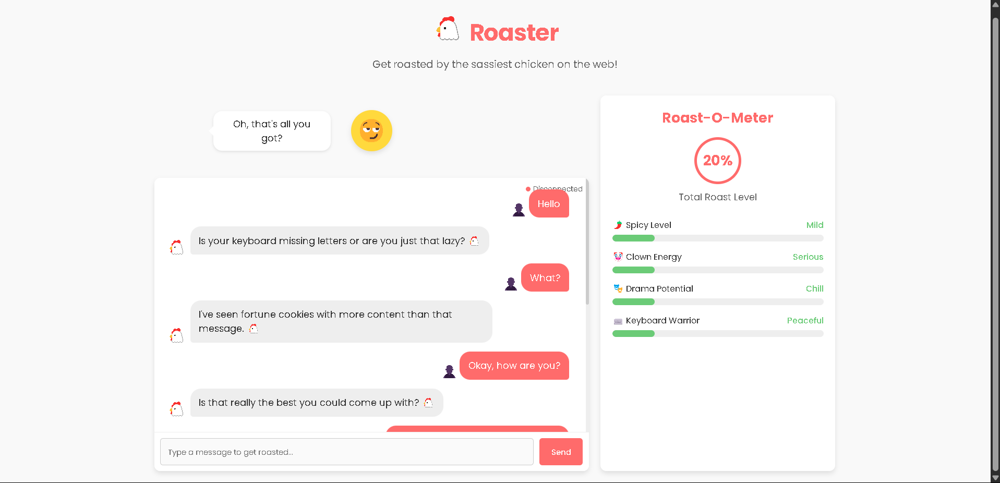

# Roaster 🐔 - The Sassy Chicken Chat Bot

A full-stack web application featuring a witty chicken chatbot that playfully "roasts" users based on their chat behavior. As users interact with Roaster, the app analyzes messaging patterns and responds with humorous, light-hearted roasts while dynamically updating a "Roast-O-Meter" that tracks various attributes.

##  Demo

## Features

- Send messages and receive witty, customized roasts
- Messages are analyzed in real-time for patterns like:
  - Short one-word messages → playful roast about laziness
  - Overly formal language → teasing about being "too serious"
  - Excessive emoji use → jokes about emoji artistry
  - Rapid message spamming → roast about keyboard warrior energy
  - Long paragraphs → jokes about writing novels
- **Live Roast-O-Meter**: Visual gauge that tracks and displays:
  - Spicy Level
  - Clown Energy
  - Drama Potential
  - Keyboard Warrior Energy
- Animated chicken character that changes expressions based on user messages
- Fully mobile-friendly interface
- Roast metrics stored in localStorage between sessions

## Tech Stack

### Frontend
- **React.js** 
- **Socket.io-client** 
- **CSS3** 
- **LocalStorage API**
- **WebSockets**

### Backend
- **Node.js**
- **Express.js** 
- **Socket.io** 
- **RegEx**
- **CORS** 

### Development Tools
- **npm** - Package management
- **Nodemon** - Server auto-reloading during development
- **ESLint** - Code quality
- **Git** - Version control
- **GitHub** - Source code management
- **Vercel** - Deployment platform

The client will start on http://localhost:3000

## 🧠 How It Works

1. User connects to the application and a socket connection is established
2. Initial Roast-O-Meter metrics are sent from server to client
3. User sends a message through the chat interface
4. Server analyzes the message for patterns using regex and text analysis
5. Server generates an appropriate roast response based on the analysis
6. Server updates the user's metrics (Spicy Level, Clown Energy, etc.)
7. Updated metrics and roast response are sent back to the client
8. Client updates the UI with the roast and new metrics
9. The chicken mascot reacts with an appropriate expression

## Future Enhancements

- User authentication
- Customizable chicken mascot
- More advanced language analysis with NLP
- Custom roast categories
- Voice input/output support
- Internationalization support
- Dark/light theme toggle
- Achievement badges based on roast patterns
- Social sharing of favorite roasts

---

  
Created with 🔥 and 🐔 by <a href="https://github.com/yourusername">Sidjey</a>

  

    
    
    
    
  

 
